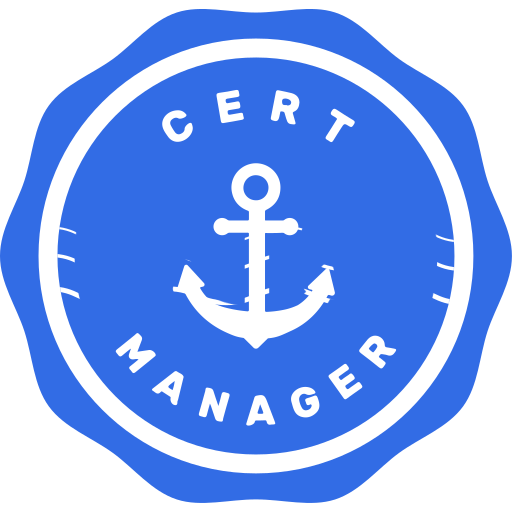

# Overview 🍩

This git repository is for my homelab cluster called LISA. At my house we name our servers after the Simpsons. This project is a personal playground for learning and experimenting with Kubernetes, GitOps, and infrastructure tooling.

---

# Architecture

## Nodes

Each node runs Ubuntu as the base OS with [k3s](https://k3s.io).

| Node        | Role   | RAM  | Disk  |
|-------------|--------|------|-------|
| lisa-master | Master | 16GB | 512GB |
| lisa-node-1 | Worker | 16GB | 512GB |
| lisa-node-2 | Worker | 16GB | 512GB |

## Currently Running

All applications are deployed via ArgoCD using an app-of-apps pattern. Manifests and Helm charts are defined in `argocd-applications/`.


| Component                                                     | Purpose                                                                                                                                                                              | Logo                                                       |
|---------------------------------------------------------------|--------------------------------------------------------------------------------------------------------------------------------------------------------------------------------------|------------------------------------------------------------|
| [ArgoCD](https://github.com/argoproj/argo-cd)                 | Handles Continuous Delivery (CD) via GitOps. Specified manifests are synced from this repository to the cluster.                                                                     |            |
| [HashiCorp Vault](https://github.com/hashicorp/vault)         | Runs on-cluster for secret management. Secrets are injected into pods via the Vault Agent sidecar.                                                                                   |             |
| [Ad Guard](https://github.com/AdguardTeam/AdGuardHome)        | Runs on-cluster for DNS management and ad blocking. DNS queries are filtered and resolved via customizable blocklists and upstream resolvers.                                        |           |
| [cert-manager](https://cert-manager.io/)                      | Runs on-cluster for certificate management. Certificates are automatically issued and renewed when ingress resources request them.                                                   |      |
| [external-secrets](https://external-secrets.io/latest/)       | Syncs secrets from HashiCorp Vault into Kubernetes-native Secret objects across workloads.                                                                                            |  |
| [cloudnative-pg](https://cloudnative-pg.io/)                  | Manages PostgreSQL instances as Kubernetes-native resources with automated failover and backups.                                                                                     |    |
| [Authentik](https://github.com/goauthentik/authentik)         | Handles Single Sign On(SSO) via OIDC and SAML configurations. Opperates on-cluster for cluster.                                                                                      |         |
| [Gatekeeper](https://github.com/open-policy-agent/gatekeeper) | Enforces custom polices written in [rego](https://www.openpolicyagent.org/docs/policy-language). Manifest are dynamically valiaded against policies before admission to the cluster. |               |


## someday.md

Applications I hope to deploy. These are not in order by any means.

| Component                                                                   | Purpose                                    |
|-----------------------------------------------------------------------------|--------------------------------------------|
| [BookStack](https://github.com/BookStackApp/BookStack)                      | Personal Wiki for all things LISA-related. |
| [bitwarden](https://bitwarden.com/help/self-host-bitwarden/)                | Personal Password Management               |
| [paperless](https://docs.paperless-ngx.com/advanced_usage/#troubleshooting) | Manage Paper Documents                     |
| [vert.sh](https://vert.sh/)                                                 | Local Hosted File Convertions              |
| [Grafana & Prometheus](https://grafana.com/)                                | Monitoring                                 |


## File Structure

Current file structure of the repository.

```txt
lisa-cluster
├── argocd-applications # applications for argocd 
├── bootstrap # bootstrap yaml for app-of-app structure (argocd)
├── images # Images like diagrams & logos
├── manifests # custom manifests like points of ingress
└── policies # OPA policies 
```