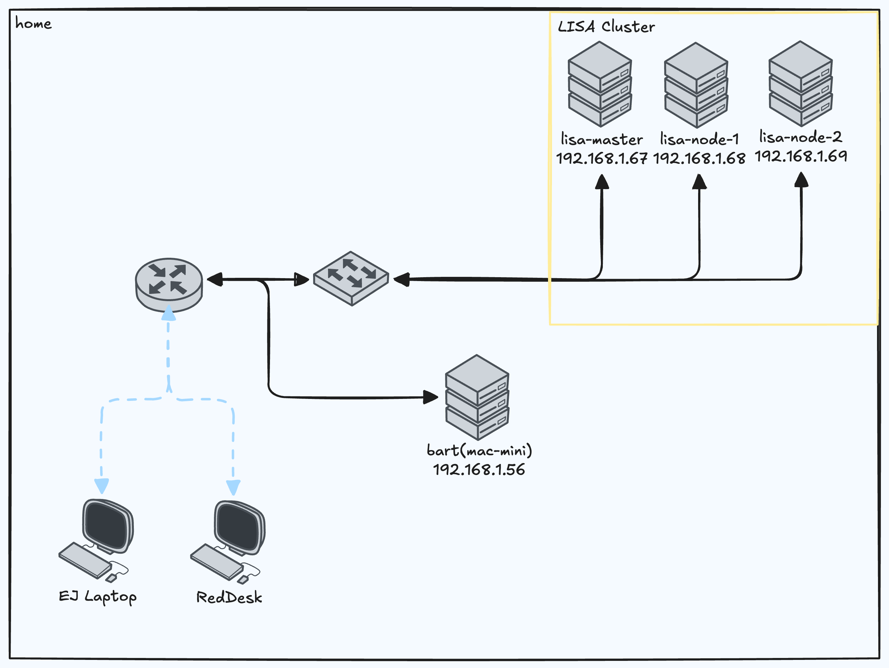

# Overview 🍩

This git repository is for my homelab cluster called LISA. At my house we name our servers after the Simpsons. This project is a personal playground for learning and experimenting with Kubernetes, GitOps, and infrastructure tooling.

---

# Architecture

## Nodes

Each node runs Ubuntu as the base OS with [k3s](https://k3s.io).

| Node        | Role   | RAM  | Disk  |
|-------------|--------|------|-------|
| lisa-master | Master | 16GB | 512GB |
| lisa-node-1 | Worker | 16GB | 512GB |
| lisa-node-2 | Worker | 16GB | 512GB |

---

## Network & Access

Currently all traffic is local-only, nothing is exposed to the internet. For my ingress controller I use [Traefik](https://traefik.io/traefik), while it is the default I really like it and I like using it. I use [AdGuard Home](https://adguard.com/en/adguard-home/overview.html) as my DNS server. AdGuard allows for a DNS rewrite rule, meaning all `*.lisa` queries are forwarded to one of the node IPs. Every service gets a clean URL like `authentik.lisa` and `adguard.lisa`. For the Kubernetes DNS server, CoreDNS, it forwards all `*.lisa` to AdGuard, so pods inside the cluster can also resolve `*.lisa` domains.



---

## Currently Running

All applications are deployed via ArgoCD using an app-of-apps pattern. Manifests and Helm charts are defined in `argocd-applications/`.

| Component                                                     | Purpose                                                                                                                                                                                 | Logo                                                       |
|---------------------------------------------------------------|-----------------------------------------------------------------------------------------------------------------------------------------------------------------------------------------|------------------------------------------------------------|
| [ArgoCD](https://github.com/argoproj/argo-cd)                 | Handles Continuous Delivery (CD) via GitOps. Specified manifests are synced from this repository to the cluster.                                                                        |            |
| [HashiCorp Vault](https://github.com/hashicorp/vault)         | Runs on-cluster for secret management and PKI. Secrets are injected into pods via the Vault Agent sidecar.                                                                              |             |
| [Ad Guard](https://github.com/AdguardTeam/AdGuardHome)        | Runs on-cluster for DNS management and ad blocking. DNS queries are filtered and resolved via customizable blocklists and upstream resolvers.                                           |           |
| [cert-manager](https://cert-manager.io/)                      | Runs on-cluster for certificate management. Certificates are automatically issued and renewed when ingress resources request them.                                                      |      |
| [external-secrets](https://external-secrets.io/latest/)       | Syncs secrets from HashiCorp Vault into Kubernetes-native Secret objects across workloads.                                                                                              |  |
| [cloudnative-pg](https://cloudnative-pg.io/)                  | Manages PostgreSQL instances as Kubernetes-native resources with automated failover and backups.                                                                                        |    |
| [Authentik](https://github.com/goauthentik/authentik)         | Handles Single Sign On (SSO) via OIDC and SAML configurations. Operates on-cluster for cluster.                                                                                         |         |
| [Gatekeeper](https://github.com/open-policy-agent/gatekeeper) | Enforces custom policies written in [rego](https://www.openpolicyagent.org/docs/policy-language). Manifests are dynamically validated against policies before admission to the cluster. |               |
| [Grafana & Prometheus](https://grafana.com/)                  | Handles Monitoring and Observability. Metrics are collected by Prometheus, visualized through Grafana Dashboards, and alerted out via AlertManager.                                     |           |

## Design Decisions

### ArgoCD

Handles Continuous Delivery (CD) via GitOps. Specified manifests are synced from this repository to the cluster allowing this repository to act as the single source of truth.

I chose ArgoCD over Flux because of its built-in UI, stronger RBAC model, and generally more intuitive workflow. I didn't want to be manually running kubectl apply against the cluster. Instead, everything lives in Git, and ArgoCD makes sure the cluster matches.

### HashiCorp Vault

Runs on-cluster for secret management and PKI. Secrets are injected into pods via the Vault Agent sidecar.

I went with Vault over Sealed Secrets because Sealed Secrets didn't feel production-ready for what I needed. It has no real way to do secret rotation, and that was a dealbreaker. Vault gives me rotation, a proper PKI backend, and a foundation that scales if the cluster grows.

### External Secrets Operator

Syncs secrets from HashiCorp Vault into Kubernetes-native Secret objects across workloads.

Vault has its own sidecar injector, but ESO gives me more flexibility in how and where secrets get deployed. It also helps with separation Vault owns the secrets, ESO handles the delivery, and workloads stay simple.

### AdGuard Home

Runs on-cluster for DNS management and ad blocking. DNS queries are filtered and resolved via customizable blocklists and upstream resolvers.

AdGuard Home feels modern with polished controls, a clean UI, and built-in encrypted DNS support. I prioritized those things over what Pi-hole offers, like more advanced query logging and community plugins.

### cert-manager

Runs on-cluster for certificate management. Certificates are automatically issued and renewed when ingress resources request them.

cert-manager solves the kind of problem I'm most likely to forget. It pulls certificates from the local PKI (Vault) and automatically manages them for Ingress resources, so I never have to think about cert expiry.

### CloudNative-PG

Manages PostgreSQL instances as Kubernetes-native resources with automated failover and backups.

Authentik requires a PostgreSQL database instead of manually managing my own StatefulSet I wanted something purpose built and already refined. CloudNative-PG feels very plug-and-play with it handling provisioning, failover, and backups.

### Authentik

Handles Single Sign On (SSO) via OIDC and SAML configurations. Operates on-cluster for cluster.

I really wanted an IdP in my cluster. I used to manage Okta professionally (if you're curious), and after that experience I felt like I could never go back to not having centralized auth. Keycloak is the industry standard, but it felt bulky for a homelab. Authentik is lighter, has a great UI, and I wanted to try something newer.

### OPA Gatekeeper

Enforces custom policies written in [rego](https://www.openpolicyagent.org/docs/policy-language). Manifests are dynamically validated against policies before admission to the cluster.

Currently no policies have been written however I want to require pinning versions, having resource limits, and no privileged containers.

---

## Backlog

Applications I want to deploy. These are not in order by any means.

| Component                                                                   | Purpose                                   |
|-----------------------------------------------------------------------------|-------------------------------------------|
| [BookStack](https://github.com/BookStackApp/BookStack)                      | Personal wiki for all things LISA-related |
| [Bitwarden](https://bitwarden.com/help/self-host-bitwarden/)                | Self-hosted password management           |
| [Paperless](https://docs.paperless-ngx.com/advanced_usage/#troubleshooting) | Digital document management               |
| [vert.sh](https://vert.sh/)                                                 | Locally hosted file conversions           |
| [Harbor](https://goharbor.io/)                                              | On-cluster container registry             |

---

## Repository Structure

```txt
lisa-cluster
├── argocd-applications # centerlized argocd applications
├── bootstrap # bootstrap, defines app-of-apps for argocd
├── images # images and technical diagrams
├── manifests # additional customizations and custom deployments
├── policies # policy-as-code lives here
└── scripts # custom scripts 
```

---
