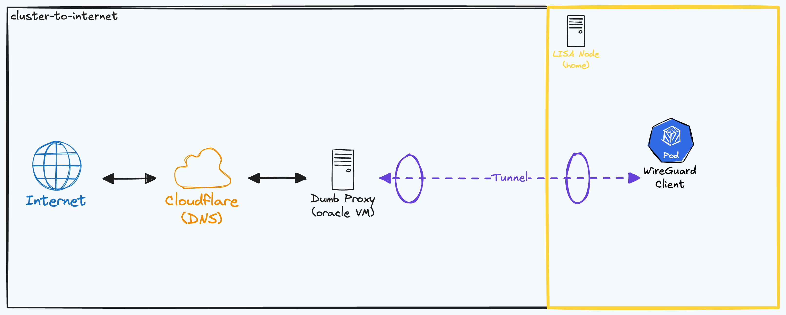

# Overview

LISA is local-only right now, and I want to change that without exposing my home IP or opening ports on my network. To solve this I'm standing up a VM on [Oracle Cloud](https://www.oracle.com/cloud/) as a public-facing proxy, tunneled back to the cluster over WireGuard. Oracle has a good free tier, which makes it an easy pick for a homelab. The Terraform for provisioning the VM lives here.

